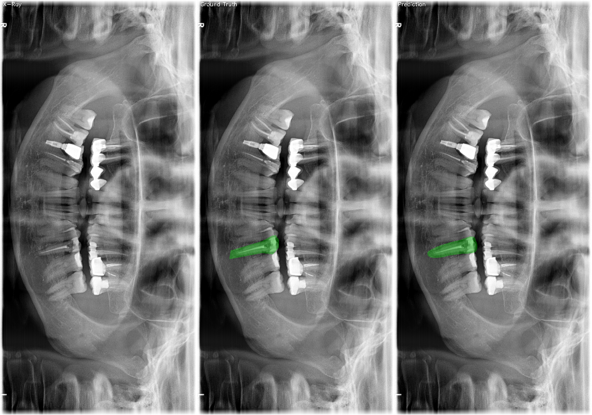
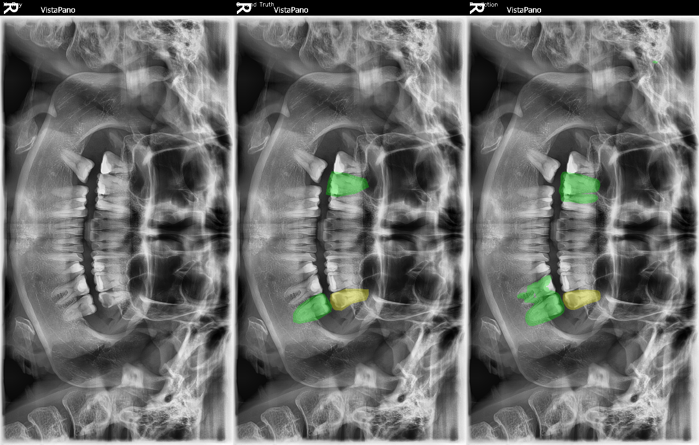

# DENTEX Dental Pathology Segmentation

Semantic segmentation of dental pathologies on panoramic X-rays using nnU-Net, trained on the [DENTEX MICCAI 2023](https://dentex.grand-challenge.org/) challenge dataset.


*Left: Original X-ray | Middle: Ground Truth | Right: Model Prediction (Dice: 0.915)*

---

## Overview

This project trains a self-configuring U-Net (nnU-Net) to perform pixel-wise classification of dental pathologies on panoramic radiographs. Given an X-ray, the model identifies and segments four categories of abnormal teeth:

| Label | Pathology | Color |
|-------|-----------|-------|
| 1 | Impacted Tooth |  Blue |
| 2 | Caries |  Green |
| 3 | Deep Caries |  Red |
| 4 | Periapical Lesion |  Yellow |

---

## The Results

Trained for 1000 epochs on NVIDIA H100 (Vast.ai) and evaluated on a held-out validation set:

| Pathology | Dice Score | Cases |
|-----------|-----------|-------|
| Impacted | 0.773 | 51 |
| Caries | 0.461 | 110 |
| Deep Caries | 0.137 | 19 |
| Periapical Lesion | 0.533 | 56 |
| **Mean** | **0.411** | **236** |

> Deep Caries performance is constrained by severe class imbalance — only 19 validation cases. A known limitation and direction for future work.

### Best Case Prediction (Dice: 0.915)


### Qualitative Analysis


---

## Dataset

**DENTEX Challenge 2023** — Dental Enumeration and Diagnosis on Panoramic X-rays  
Organized alongside MICCAI 2023.

- 705 fully annotated panoramic X-rays
- Annotations follow the FDI Numbering System
- 4 diagnosis classes: Caries, Deep Caries, Periapical Lesions, Impacted Teeth
- Images from 3 institutions with varying equipment and protocols

Dataset: [Kaggle](https://www.kaggle.com/datasets/truthisneverlinear/dentex-challenge-2023) | [Zenodo](https://zenodo.org/record/7812323)

---

## Architecture

nnU-Net auto-configured a **9-stage 2D PlainConvUNet** based on dataset fingerprinting:

```
Input: Grayscale panoramic X-ray (avg 2852 × 1316 px)
       ↓
Encoder: 9 stages, features 32 → 512
         (Conv → InstanceNorm → LeakyReLU) × 2 per stage
       ↓
Bottleneck: 512 feature maps
       ↓
Decoder: 8 stages with skip connections
       ↓
Output: 5-channel softmax mask (background + 4 classes)
```

**Key auto-configured settings:**
- Patch size: 1792 × 768
- Batch size: 2
- Normalization: Z-Score
- Loss: Dice + Cross Entropy
- Optimizer: SGD with momentum, polynomial LR decay

---

## Pipeline

```
DENTEX PNG + COCO JSON
        ↓  convert_dentex.py
NIfTI images (.nii.gz) + pixel masks
        ↓  nnUNetv2_plan_and_preprocess
Auto-configured preprocessing
        ↓  nnUNetv2_train 1 2d 0
Trained model weights (1000 epochs)
        ↓  nnUNetv2_predict
Segmentation masks on new X-rays
        ↓  visualize.py
Side-by-side comparison PNG
```

---

## Setup

### Requirements
- Python 3.11
- CUDA-capable GPU (trained on RTX 4070 locally + H100 via Vast.ai)

### Installation

```bash
git clone https://github.com/ImDannyVilla/dentex-seg.git
cd dentex-seg
pip install nnunetv2 nibabel opencv-python scikit-learn kaggle
```

### Environment Variables

```bash
export nnUNet_raw="$HOME/nnunet/nnUNet_raw"
export nnUNet_preprocessed="$HOME/nnunet/nnUNet_preprocessed"
export nnUNet_results="$HOME/nnunet/nnUNet_results"
```

---

## Usage

### 1. Download Dataset
```bash
kaggle datasets download truthisneverlinear/dentex-challenge-2023
unzip dentex-challenge-2023.zip -d dentex-data
```

### 2. Convert to nnU-Net Format
```bash
python convert_dentex.py \
  --dentex_dir dentex-data/training_data/training_data/quadrant-enumeration-disease \
  --output_dir ~/nnunet/nnUNet_raw/Dataset001_DENTEX
```

### 3. Preprocess
```bash
nnUNetv2_plan_and_preprocess -d 1 --verify_dataset_integrity
```

### 4. Train
```bash
nnUNetv2_train 1 2d 0 --npz
```

### 5. Predict
```bash
nnUNetv2_predict \
  -i INPUT_FOLDER \
  -o OUTPUT_FOLDER \
  -d 1 -c 2d -f 0
```

### 6. Visualize
```bash
python visualize.py
```

---

## Key Findings

- **Impacted teeth** (Dice 0.77) — easiest class, distinct shape and position
- **Periapical lesions** (Dice 0.53) — moderately learnable, located at root tips
- **Caries** (Dice 0.46) — challenging due to size variation and subtle appearance
- **Deep Caries** (Dice 0.14) — hardest class, only 19 val cases, severe imbalance
- **Metallic implants** create intensity artifacts that confuse the model — identified as primary failure mode through qualitative analysis
- **Best single-case Dice: 0.915** on a straightforward caries case without metallic artifacts

---

## Training Details

| Setting | Value |
|---------|-------|
| Framework | nnU-Net v2 |
| Architecture | 2D PlainConvUNet (9 stages) |
| Epochs | 1000 |
| Batch size | 2 |
| Patch size | 1792 × 768 |
| GPU | NVIDIA H100 80GB (Vast.ai) |
| Training time | ~3.5 hours |
| Cost | ~$5 |

---

## Future Work

- Weighted sampling to handle Deep Caries class imbalance
- Focal loss to up-weight rare/hard examples
- Data augmentation specifically for metallic implant artifacts
- Test-time augmentation for more robust predictions
- Fine-tuning with ResEnc presets (nnU-Net v2 recommendation)

---

## References

1. Isensee et al. (2021). *nnU-Net: a self-configuring method for deep learning-based biomedical image segmentation.* Nature Methods. [Paper](https://www.nature.com/articles/s41592-020-01008-z)
2. Hamamci et al. (2023). *DENTEX: An Abnormal Tooth Detection with Dental Enumeration and Diagnosis Benchmark for Panoramic X-rays.* [arXiv](https://arxiv.org/abs/2305.19112)
3. Ronneberger et al. (2015). *U-Net: Convolutional Networks for Biomedical Image Segmentation.* [arXiv](https://arxiv.org/abs/1505.04597)

---

## Author

**Daniel Villanueva** — CS Junior @ CSUB  
[dannyvilla.com](https://dannyvilla.com) | [GitHub](https://github.com/ImDannyVilla)
